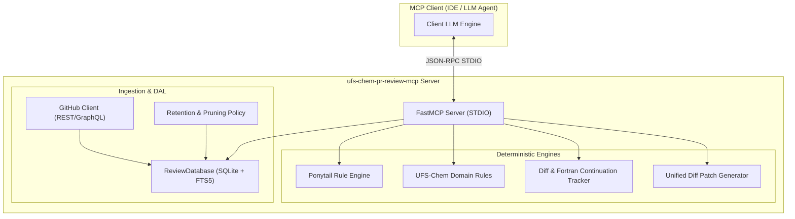

# UFS-Chem PR Review MCP Server — Architecture & Design

## 1. Executive Summary

`ufs-chem-pr-review-mcp` is a specialized, local Model Context Protocol (MCP) server designed to supercharge automated and human-in-the-loop pull request code reviews across Unified Forecast System (UFS) atmospheric chemistry repositories.

### Key Tenets
1. **Zero Runtime LLM Inside the Server**: The server operates deterministically using SQLite FTS5 lexical/keyword search, abstract syntax heuristic matching, and domain rule engines. The user's client LLM performs final synthesis, reasoning, and conversational critique.
2. **Machine-Applicable Patches**: Outputs are formatted for instant application—either as unified diffs compatible with `git apply` or GitHub Review API JSON payload containing 1-click ````suggestion ```` blocks.
3. **Safe STDIO Communication**: Logging is strictly routed to `sys.stderr` via [`logs.py`](file:///Users/bkoziol/sandbox/git-benkozi/ufs-chem-pr-review-mcp/src/ufs_chem_pr_review_mcp/logs.py). Raw `print()` calls are strictly forbidden to prevent JSON-RPC transport frame corruption.
4. **Domain-Specific Atmospheric Chemistry Rules**: Encodes rules for Fortran double-precision constants (`1.0_rk`), molecular weight mass ratio conversions ($M_{spec} / M_{air}$), dynamic memory allocation checks (`stat=rc`), and ESMF/NUOPC return code validations.
5. **Ponytail Over-Engineering Auditing**: Flags dead code, stubs, and wheel-reinventions while honoring NUOPC standard interfaces and OpenMP SIMD loop pragmas.

---

## 2. System Architecture



---

## 3. Component Details

### 3.1 Database & Full-Text Search Layer
- **Schema & Triggers** ([`db/schema.py`](file:///Users/bkoziol/sandbox/git-benkozi/ufs-chem-pr-review-mcp/src/ufs_chem_pr_review_mcp/db/schema.py)):
  - SQLite schema with foreign key constraints, `user_version` tracking, and automatic indexing.
  - Full-Text Search (FTS5) virtual table `comments_fts` synchronized via SQLite `AFTER INSERT`, `AFTER UPDATE`, and `AFTER DELETE` triggers.
- **Data Access Layer** ([`db/repository.py`](file:///Users/bkoziol/sandbox/git-benkozi/ufs-chem-pr-review-mcp/src/ufs_chem_pr_review_mcp/db/repository.py)):
  - Sanitizes search queries against FTS5 special character syntax while preserving single-variable scientific identifiers.
  - Relevance ranking based on:
    - BM25 score from FTS5
    - Code modified follow-up boost (+20.0)
    - Reviewer criticality weight (+5.0 per level)
    - File path intersection (+25.0)
    - Programming language alignment (+10.0)
- **Retention & Pruning** ([`db/pruning.py`](file:///Users/bkoziol/sandbox/git-benkozi/ufs-chem-pr-review-mcp/src/ufs_chem_pr_review_mcp/db/pruning.py)):
  - Purges pull requests older than `retention_days` and enforces `max_records_per_repo` limits.

### 3.2 Heuristic Rule Engines
- **Ponytail Heuristics** ([`rules/ponytail.py`](file:///Users/bkoziol/sandbox/git-benkozi/ufs-chem-pr-review-mcp/src/ufs_chem_pr_review_mcp/rules/ponytail.py)):
  - `delete`: Flags commented-out blocks, unused stubs, and empty functions.
  - `stdlib`: Detects re-implementations of standard mathematical or string operations.
  - `shrink`: Recommends Fortran array slice notation (`arr(:) = 0.0`) over explicit 1D scalar loops.
  - **Exemptions**: Explicitly ignores standard NUOPC interface dummy variables (`rc`, `clock`, `gcomp`) and OpenMP SIMD multi-index compute loops.
- **UFS-Chem Domain Rules** ([`rules/ufs_chem.py`](file:///Users/bkoziol/sandbox/git-benkozi/ufs-chem-pr-review-mcp/src/ufs_chem_pr_review_mcp/rules/ufs_chem.py)):
  - `single_precision_literal`: Flags real constants without double-precision kind suffixes (e.g. `1.0` -> `1.0_rk`).
  - `missing_allocate_stat`: Requires `stat=rc, errmsg=msg` on all Fortran `allocate()` calls.
  - `missing_esmf_return_code_check`: Warns when calling ESMF routines (`ESMF_StateGet`, etc.) without checking `rc == ESMF_SUCCESS`.
  - `chemistry_unit_molecular_weight`: Enforces molar mass scaling ($M_{spec}/M_{air}$) on volume-mixing-ratio to mass-mixing-ratio conversions (ppm/ppb $\to$ kg/kg).

### 3.3 Patch Engine
- **Patch Architecture** ([`models/patch.py`](file:///Users/bkoziol/sandbox/git-benkozi/ufs-chem-pr-review-mcp/src/ufs_chem_pr_review_mcp/models/patch.py)):
  - Generates unified diff hunks conforming to the Unified Diff format.
  - Hunks within identical target files are sorted in descending line order (`reverse=True`) to prevent offset drift during sequential `git apply` operations.
  - Generates single-line and multi-line GitHub review ````suggestion ```` blocks.

---

## 4. MCP Tools, Resources, and Prompts

### Tools
| Tool Name | Parameters | Description |
|-----------|------------|-------------|
| `evaluate_diff` | `diff_text`, `target_repo`, `output_format`, `review_mode`, `include_ponytail_audit`, `max_context_comments` | Evaluates raw unified diff against rules and historical context. |
| `evaluate_pr` | `repo`, `pr_number`, `output_format`, `review_mode`, `include_ponytail_audit`, `max_context_comments` | Fetches PR diff from GitHub, runs domain and Ponytail checks, retrieves relevant reviews. |
| `search_review_history` | `query`, `repo`, `language`, `category`, `min_criticality`, `has_diff_followup_only`, `limit` | Full-text FTS5 search across historical PR reviews with metadata filters. |
| `get_repo_review_stats` | `repo` | Summarizes PR counts, comment volumes, language breakdowns, and category frequencies. |
| `format_review_output` | `findings`, `critical_summary`, `output_format` | Formats finding lists into markdown, patch, or GitHub Review API JSON. |
| `generate_patch` | `patches` | Combines structured `CodePatch` items into a single unified diff patch for `git apply`. |

### Resources
- `ufs-chem://repositories`: JSON catalog of tracked atmospheric chemistry repositories.
- `ufs-chem://guidelines/{category}`: Contextual review guidelines and common reviewer pitfalls for specified categories.

### Prompts
- `review_pr`: Structured prompting template guiding the user's client LLM to conduct a rigorous review using `evaluate_pr`.
